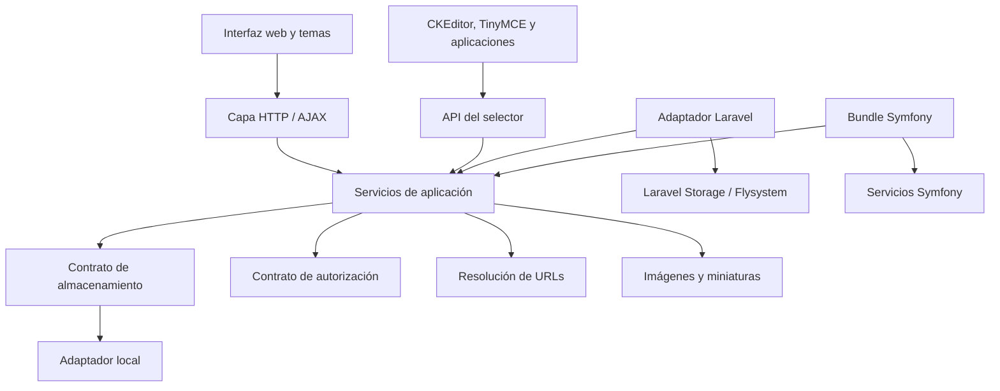

# Arquitectura y hoja de ruta de KCFinder Resurrected

> **A maintained, security-focused continuation of KCFinder, designed for modern production environments while preserving backward compatibility and lightweight deployment.**

| Campo | Valor |
|---|---|
| Estado | Borrador rector |
| Versión del documento | 0.1 |
| Fecha | 2026-07-14 |
| Alcance inicial | PHP 8.2 a PHP 8.5 |

## 1. Propósito

Este documento conserva la dirección técnica del proyecto y sirve como criterio para evaluar cambios futuros. KCFinder Resurrected debe evolucionar como un administrador de archivos mantenido, seguro y apto para producción, sin perder su instalación tradicional ni quedar acoplado a un framework.

La modernización será progresiva. Se privilegiarán cambios pequeños, comprobables y reversibles por sobre una reescritura completa del proyecto.

## 2. Objetivos

- Mantener un núcleo PHP independiente y liviano.
- Soportar inicialmente PHP 8.2, 8.3, 8.4 y 8.5 sin warnings ni deprecations ocultas.
- Conservar, cuando sea razonable, la configuración, integraciones y comportamiento público heredados.
- Proporcionar una instalación tradicional mediante un archivo ZIP autónomo.
- Publicar el núcleo como paquete Composer y en Packagist.
- Definir contratos estables para almacenamiento, autorización, URLs y selección de archivos.
- Ofrecer adaptadores oficiales para Laravel y Symfony sin convertirlos en dependencias del núcleo.
- Incorporar un selector moderno que pueda devolver metadatos estructurados.
- Mantener los temas desacoplados del núcleo e incluir una experiencia responsiva.
- Establecer pruebas, análisis estático y releases reproducibles como requisitos de publicación.

## 3. No objetivos iniciales

- Reescribir todo KCFinder en un framework.
- Exigir Laravel, Symfony, Composer, Node.js o Docker en producción.
- Reemplazar de inmediato todas las APIs heredadas.
- Incorporar almacenamiento remoto al núcleo antes de estabilizar sus contratos.
- Cambiar simultáneamente estructura, seguridad e interfaz en un único PR.
- Prometer compatibilidad indefinida con versiones de PHP sin soporte activo.

## 4. Principios de diseño

### 4.1 Núcleo independiente

El núcleo no puede depender de Laravel ni Symfony. Los frameworks deben integrarse mediante adaptadores que implementen contratos públicos del núcleo.

### 4.2 Compatibilidad explícita

La compatibilidad se protege mediante pruebas de caracterización. Una API heredada sólo se retirará después de documentar su reemplazo, anunciar su deprecación y reservar el cambio para una versión mayor.

### 4.3 Seguridad por defecto

Las rutas, los permisos y los metadatos deben resolverse en el servidor. El navegador no será una fuente confiable para rutas, MIME, tamaño, autorización ni URLs finales.

### 4.4 Dependencias mínimas

Composer será el mecanismo de desarrollo y una opción de instalación. La distribución tradicional seguirá incluyendo todo lo necesario para funcionar sin ejecutar Composer en el servidor.

### 4.5 Una sola fuente

El paquete Composer y el ZIP autónomo se generarán desde la misma base de código. No se mantendrán dos implementaciones independientes.

### 4.6 Extensión antes que modificación

Los temas, adaptadores de frameworks, almacenamientos adicionales y editores deben utilizar puntos de extensión documentados, evitando modificaciones directas del núcleo.

## 5. Arquitectura objetivo



### 5.1 Capas

1. **Dominio y metadatos:** valores normalizados de archivo, ruta, tamaño y MIME.
2. **Servicios de aplicación:** listar, subir, descargar, renombrar, mover, copiar, transformar y eliminar.
3. **Infraestructura:** sistema de archivos local, generación de miniaturas, sesiones y resolución de URLs.
4. **HTTP:** validación de solicitudes, CSRF, serialización JSON y traducción de errores.
5. **Presentación:** interfaz, temas, selector y adaptadores JavaScript.
6. **Integraciones:** Laravel, Symfony, CKEditor, TinyMCE y aplicaciones personalizadas.

Las reglas de archivos y seguridad no deben residir exclusivamente en controladores AJAX o JavaScript.

## 6. Contratos del núcleo

Las firmas definitivas se aprobarán mediante decisiones de arquitectura, pero el diseño debe contemplar al menos estos conceptos:

```php
interface FilesystemAdapterInterface
{
    public function list(string $path): array;
    public function metadata(string $path): FileMetadata;
    public function upload(string $path, UploadedFile $file): FileMetadata;
    public function delete(string $path): void;
}

interface AuthorizationInterface
{
    public function can(string $operation, string $path): bool;
}

interface UrlResolverInterface
{
    public function url(string $path): string;
}
```

Estas interfaces son ilustrativas. Antes de convertirlas en API pública se deben resolver manejo de errores, operaciones sobre carpetas, streams, escritura atómica y compatibilidad con archivos grandes.

El almacenamiento local será la implementación predeterminada. Flysystem podrá incorporarse como adaptador opcional, no como requisito obligatorio del núcleo.

## 7. Contrato del selector de archivos

### 7.1 Objeto seleccionado

El selector moderno debe poder devolver, como mínimo:

```json
{
  "name": "DO-20130614.pdf",
  "path": "/01-actos/diario-oficial/2013/DO-20130614.pdf",
  "url": "/storage/transparencia/01-actos/diario-oficial/2013/DO-20130614.pdf",
  "mime": "application/pdf",
  "size": 184320
}
```

Semántica:

- `name`: nombre final sin directorio.
- `path`: ruta lógica normalizada dentro del almacenamiento configurado; nunca una ruta física del servidor.
- `url`: URL resuelta por el servidor o el adaptador activo.
- `mime`: tipo comprobado en el servidor mediante Fileinfo cuando esté disponible.
- `size`: entero en bytes obtenido desde el almacenamiento.

El objeto podrá crecer de forma compatible con propiedades opcionales. La eliminación o reinterpretación de propiedades requerirá una nueva versión del contrato.

La implementación inicial y su uso independiente de los endpoints heredados se documentan en [FileMetadataContract.md](FileMetadataContract.md).

### 7.2 Canales de entrega

Se conservarán los callbacks heredados y se agregarán:

- Callback JavaScript que recibe el objeto completo.
- Selección simple y múltiple.
- Evento `window.postMessage()` para integraciones entre ventanas.
- Adaptadores documentados para CKEditor y TinyMCE.

El mensaje moderno tendrá un sobre versionado:

```javascript
window.parent.postMessage({
    event: 'kcfinder:file-selected',
    version: 1,
    file: selectedFile
}, allowedOrigin);
```

`allowedOrigin` debe configurarse y validarse. No se utilizará `'*'` como valor predeterminado en producción.

## 8. Seguridad

La línea base de producción debe incluir:

- Confinamiento de todas las rutas bajo una raíz autorizada.
- Rechazo de traversal, bytes nulos, separadores ambiguos y nombres peligrosos.
- Validación combinada de extensión, MIME y política de tipo de archivo.
- Política explícita para SVG, HTML, scripts y archivos ejecutables.
- CSRF en todas las operaciones mutables.
- Autorización por operación y ruta, independiente de la visibilidad de botones.
- Cookies y sesiones con configuración segura.
- Respuestas JSON sin trazas o rutas físicas en producción.
- Encabezados de seguridad configurables.
- Registro opcional de operaciones sensibles.
- Procesamiento seguro de imágenes, archivos comprimidos y recursos remotos.

Las configuraciones inseguras heredadas podrán mantenerse durante una migración, pero deberán generar advertencias claras y contar con reemplazos documentados.

## 9. Distribución y Composer

El repositorio mantendrá dos formas oficiales de instalación:

### 9.1 Distribución tradicional

- ZIP listo para copiar en un servidor PHP compatible.
- Sin Node.js, Composer ni Docker obligatorios en producción.
- Configuración mediante archivos y sesiones compatible con instalaciones existentes.
- Assets y dependencias de ejecución incluidos en el artefacto.

### 9.2 Paquete Composer

- Autoload PSR-4 para el código nuevo.
- Requisitos de PHP y extensiones declarados explícitamente.
- Dependencias de producción mínimas.
- Herramientas de pruebas y análisis sólo en `require-dev`.
- Scripts reproducibles de validación y construcción.
- Publicación en Packagist desde tags firmes del repositorio.

El nombre definitivo del paquete, el namespace PHP y la política de inclusión de recursos se aprobarán mediante un ADR antes de publicarlo.

## 10. Integración con Laravel

El adaptador Laravel será un paquete independiente que dependa del núcleo. Debe proporcionar:

- Service provider y configuración publicable.
- Rutas opcionales y prefijo configurable.
- Middleware de autenticación y autorización.
- Integración con Gates o callbacks de autorización.
- Uso de discos de Laravel Storage.
- Resolución de URLs públicas, temporales o firmadas.
- Protección CSRF del framework.
- Helper Blade o componente JavaScript para abrir el selector.
- Eventos para uploads, cambios y eliminaciones.

El adaptador no expondrá rutas físicas de `storage/app` y no asumirá que todos los discos tienen una URL pública.

## 11. Integración con Symfony

El bundle Symfony será un paquete independiente que dependa del núcleo. Debe proporcionar:

- Extensión y configuración del bundle.
- Servicios registrados mediante el contenedor.
- Rutas importables y prefijo configurable.
- Integración con Security, Voters y CSRF.
- Adaptadores de almacenamiento y resolución de URLs.
- Helper Twig o componente JavaScript para el selector.
- Eventos para operaciones relevantes.

Las integraciones de Laravel y Symfony deben compartir los contratos y pruebas de conformidad del núcleo, sin duplicar reglas de seguridad.

## 12. Interfaz responsiva y móvil

La interfaz móvil utilizará el mismo documento y las mismas operaciones que escritorio.

- En escritorio, el árbol de carpetas seguirá visible y será redimensionable.
- En pantallas estrechas, se convertirá en un panel lateral superpuesto.
- Un botón **Carpetas** abrirá y cerrará el panel.
- El panel se cerrará al seleccionar una carpeta, tocar el fondo o presionar `Escape`.
- El foco quedará contenido dentro del panel abierto y volverá al botón al cerrarse.
- Las acciones principales tendrán áreas táctiles de al menos 44 por 44 píxeles.
- La barra de herramientas podrá reorganizarse sin superponer controles.
- Los diálogos respetarán el viewport.
- La vista de lista ocultará progresivamente información secundaria en anchos reducidos.
- Las funciones esenciales operarán con mouse, teclado y tacto.

Los temas seguirán siendo paquetes desacoplados. El tema Bootstrap 5 podrá distribuirse e integrarse oficialmente sin impedir el uso del tema clásico o de temas de terceros.

## 13. Compatibilidad y deprecaciones

- El comportamiento heredado se documentará mediante pruebas antes de refactorizarlo.
- Las configuraciones antiguas se traducirán a objetos internos normalizados.
- Toda deprecación indicará alternativa y versión prevista de retiro.
- Los cambios incompatibles se reservarán para versiones mayores.
- La compatibilidad cubre APIs, configuración y flujos documentados; no implica mantener indefinidamente runtimes PHP sin soporte.
- Los adaptadores de frameworks tendrán ciclos de versión propios compatibles con una versión declarada del núcleo.

## 14. Calidad y automatización

Cada release deberá comprobar:

- Sintaxis PHP.
- PHPUnit.
- Análisis estático progresivo con PHPStan.
- Matriz de PHP 8.2, 8.3, 8.4 y 8.5.
- Operaciones AJAX y contrato JSON.
- Navegación, upload, miniaturas, descarga, sesiones y CSRF.
- Selector heredado y selector moderno.
- Pruebas reales de navegador en vistas de escritorio y móvil.
- Construcción reproducible del ZIP tradicional.
- Instalación mediante Composer desde un proyecto vacío.
- Ausencia de warnings y deprecations ocultas.

Docker seguirá siendo una herramienta opcional para desarrollo y pruebas, no un requisito de instalación.

## 15. Estrategia de repositorios

La separación preferida es:

1. **KCFinder Resurrected:** núcleo, distribución tradicional y contratos públicos.
2. **Tema Bootstrap 5:** fuente y distribución versionada del tema.
3. **Adaptador Laravel:** paquete y pruebas específicas de Laravel.
4. **Bundle Symfony:** paquete y pruebas específicas de Symfony.

Esta separación evita incorporar dependencias de frameworks al núcleo y permite publicar versiones según sus respectivos ciclos. Durante la etapa inicial, ejemplos mínimos pueden vivir en el repositorio principal hasta estabilizar el contrato público.

## 16. Entrega incremental

### Fase 1: línea base

- Inventariar endpoints, configuración y APIs heredadas.
- Crear pruebas de caracterización.
- Completar compatibilidad PHP 8.2 a 8.5.
- Definir política de soporte y seguridad.

### Fase 2: seguridad

- Consolidar rutas, uploads, imágenes, sesiones y CSRF.
- Agregar pruebas negativas y casos de abuso.
- Documentar configuración segura por defecto.

### Fase 3: servicios y contratos

- Extraer metadatos y operaciones sin alterar endpoints públicos.
- Introducir adaptadores local, autorización y URLs.
- Mantener una capa de compatibilidad con la configuración actual.

### Fase 4: selector moderno

- Implementar el objeto de archivo y su versión 1.
- Agregar callback estructurado y `postMessage` con origen validado.
- Probar selección simple, múltiple y compatibilidad heredada.

### Fase 5: empaquetado

- Estabilizar namespace y autoload.
- Publicar paquete Composer y ZIP desde la misma fuente.
- Automatizar releases y validación de artefactos.

### Fase 6: interfaz responsiva

- Implementar el panel móvil de carpetas.
- Ajustar barras, listas, miniaturas y diálogos.
- Verificar accesibilidad y flujos táctiles.

### Fase 7: adaptadores

- Publicar el adaptador Laravel.
- Publicar el bundle Symfony.
- Mantener aplicaciones de ejemplo y pruebas de integración.

## 17. Versionado propuesto

- `4.1`: compatibilidad PHP, pruebas y seguridad fundamental.
- `4.2`: selector JSON, eventos y metadatos estables.
- `4.3`: contratos internos y distribución Composer.
- `4.4`: interfaz responsiva y accesibilidad.
- `4.5`: adaptadores oficiales para Laravel y Symfony.
- `5.0`: sólo si es necesario retirar APIs heredadas o introducir cambios incompatibles.

Las versiones definitivas podrán ajustarse según el estado real del código. Una versión mayor no se utilizará únicamente como señal de marketing.

## 18. Criterios para declarar el proyecto listo para producción

El objetivo de este documento se considerará cumplido cuando exista evidencia de:

- Configuración segura por defecto.
- Compatibilidad comprobada en la matriz PHP declarada.
- Cero warnings y deprecations ocultas.
- Operaciones críticas cubiertas por pruebas automatizadas.
- Contrato estable y documentado del selector.
- Release reproducible en ZIP y Composer.
- Instalación independiente y mediante frameworks comprobada.
- Guía de migración desde KCFinder Resurrected 4.0.
- Política de versiones, soporte y reporte de vulnerabilidades.
- Experiencia funcional en escritorio, tablet y móvil.

## 19. Decisiones pendientes

Cada decisión con impacto público debe registrarse como un ADR corto antes de implementarse. Las primeras decisiones pendientes son:

1. Nombre del paquete Packagist y namespace PHP.
2. Forma de compatibilizar el cargador heredado con PSR-4.
3. Modelo definitivo de errores y excepciones públicas.
4. API de streams y archivos grandes.
5. Contrato de selección múltiple.
6. Política y alcance de Flysystem.
7. Compatibilidad inicial de versiones de Laravel y Symfony.
8. Política de URLs públicas, temporales y firmadas.
9. Separación exacta entre assets del núcleo y temas.

## 20. Regla para aceptar cambios

Todo cambio relevante debe responder afirmativamente:

1. ¿Acerca el proyecto a los objetivos de este documento?
2. ¿Conserva o migra explícitamente el comportamiento existente?
3. ¿Mantiene independiente al núcleo?
4. ¿Evita una dependencia obligatoria innecesaria?
5. ¿Incluye pruebas proporcionales al riesgo?
6. ¿Mantiene segura la instalación predeterminada?
7. ¿Puede distribuirse tanto por ZIP como por Composer?

Si la respuesta es negativa, el cambio requiere una decisión de arquitectura explícita antes de ser incorporado.
